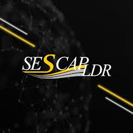

# LicencaAgil

<h1>Projeto Licença ágil</h1>

Estou criando um projeto de startup onde eu e minha equipe de desenvolvimento estamos criando um software de gestão para cadastrar e gerenciar todo o processo de abertura e liberação de alvará de novas empresas.

<h1>empresas parceiras</h1>

SESCAP-LONDRINA 

<h2>Tecnologias usadas no desenvolvimento</h2>

<h2>Imagens do projeto</h2>

